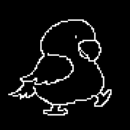
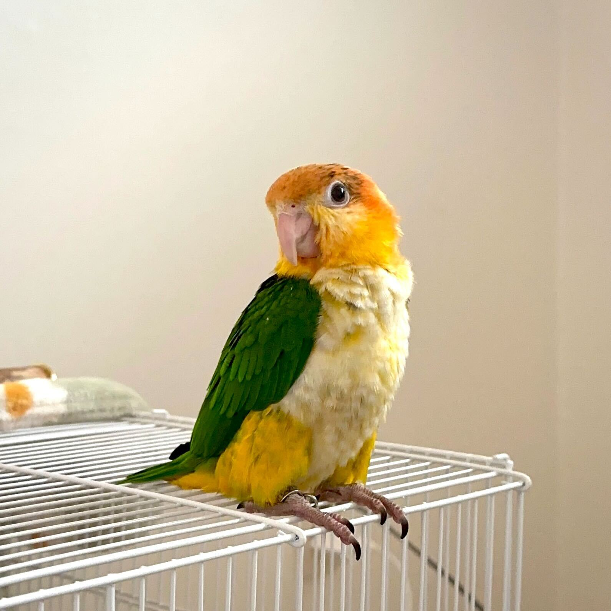

  <a href="https://marketplace.visualstudio.com/items?itemName=JunbaeJs.junbae-mode&ssr=false#overview">
    
    <h1 align="center">Junbae Mode</h1>
  </a>

  
  

## Getting Started

키보드를 활용해 타이핑을 할 때마다 귀여운 준배가 당신과 함께 합니다. 
지루하고 따분한 코딩인생, 준배의 랜선 이모/삼촌이 되어 극복해보세요. 
모드에 따라 다양한 준배의 모습을 구경할 수 있어요!

마켓플레이스에서 [준배모드](https://marketplace.visualstudio.com/items?itemName=JunbaeJs.junbae-mode&ssr=false#overview)를 다운받아 사용해보세요!

## Who is Junbae?

저희의 마스코트인 아주아주 귀여운 준배를 소개합니다! 
준배는 카이큐 앵무새이고, 아주 귀엽죠. 
주황색 머리와 하얀색 배, 초록색 등을 가진 아주 귀여운 앵무새에요.  
준배는 [Arthur Hwang](https://github.com/changchanghwang)의 반려앵무이고, 여자아이에요. 
23년 12월 3일에 태어나, 이제 1살이 되었죠. 
그리고 아주 귀엽고, 귀엽고 또 귀엽습니다.  

준배의 귀여운 매력에 빠져, 저희는 코딩할 때도 준배를 떠올리는 날들이 많았습니다. 
그래서 코딩을 하면 준배를 볼 수 있도록 준배모드를 만들었어요! 
여러분도 준배의 귀여움에 같이 빠져보세요!

## Who is using Junbae Mode?

- 코딩을 하면서 귀여운 준배의 매력에 빠지고 싶으신 분!
- 평범함은 저리가라! 간지나게 코딩하고 싶으신 분!
- 지루한 개발 일상에 활력을 불어넣고 싶으신 분!
- 회사에서 관심받고 싶으신 분!

## Warning

준배는 여러분들의 개발을 효율적으로 돕거나 실력을 향상시켜 주지는 않습니다. 
준배에게 빠져 해야할 일을 잊지 않도록 주의가 필요합니다.

하지만 귀여웠죠?

## Contributing

준배모드에 기여하고 싶으신 분은 저희의 [CONTRIBUTING.md](/CONTRIBUTING.md) 문서를 확인해주세요!

## Authors

- [Arthur Hwang](https://github.com/changchanghwang)
- [Myunggyuns](https://github.com/myunggyuns)
- [Sunnieee](https://github.com/sunnieeeYoon)
