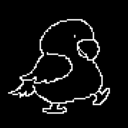

  <a href="https://marketplace.visualstudio.com/items?itemName=JunbaeJs.junbae-mode&ssr=false#overview">
    
    <h1 align="center">Junbae Mode</h1>
  </a>

  
  

## Getting Started

Whenever you type, the adorable Junbae will be with you. 
Overcome the dull coding life by becoming Junbae's aunt/uncle. 
You can enjoy various appearances of Junbae depending on the mode!

Download and try [Junbae Mode](https://marketplace.visualstudio.com/items?itemName=JunbaeJs.junbae-mode&ssr=false#overview) out on the marketplace!

## Who is Junbae?

Let us introduce our mascot, the incredibly cute Junbae! 
Junbae is a caique parrot, and oh so adorable. 
With an orange head, white belly, and green feathers, Junbae is an incredibly cute parrot. 
Born on December 3, 2023, Junbae has just turned one year old. She is Arthur Hwang's pet parrot.

Enchanted by Junbae's charm, we often find ourselves thinking of her even while coding. 
That's why we've introduced the Junbae mode, allowing you to enjoy Junbae's presence during typing. 
Come and immerse yourself in the adorable allure of Junbae together!

## Who is using Junbae Mode?

- Those who want to be captivated by the charm of cute Junbae while coding!
- Those who want to code stylishly and break away from the ordinary!
- Those who want to infuse vitality into their boring development routine!
- Those who want to be noticed at work!

## Warning
Junbae doesn't directly help you with your development or improve your skills. 
Be careful not to get too caught up with Junbae and forget your tasks.

But isn't it adorable?

## Contributing

If you want to contribute to Junbae Mode, please check our [CONTRIBUTING.md](/CONTRIBUTING.md) document!

## Authors
- [Arthur Hwang](https://github.com/changchanghwang)
- [Myunggyuns](https://github.com/myunggyuns)
- [Sunnieee](https://github.com/sunnieeeYoon)

